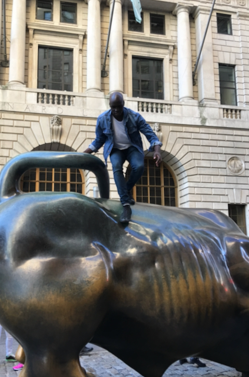

# Mut Tulow's Portfolio
A public repository of projects and assignments to highlight skills.

---

## Careers
- [Data Engineer](./careers/data_engineer.md)
- [Data Analyst](./careers/data_analyst.md)
- [Data Scientist](./careers/data_scientist.md)
- [AI Engineer](./careers/ai_engineer.md)
- [Geospatial Data Scientist](./careers/geospatial_data_scientist.md)

---

## Courses
- __Galvanize:__
  - [x] [Basic Prep](https://www.galvanize.com/alumni/)
  - [x] [Data Science Immersive](https://www.galvanize.com/alumni/)
- __Data Talks Club:__
  - [x] [Data Engineering Zoomcamp](https://github.com/DataTalksClub/data-engineering-zoomcamp)
  - [x] [MLOps Zoomcamp](https://github.com/DataTalksClub/mlops-zoomcamp)
  - [x] [Machine Learning Zoomcamp](https://github.com/DataTalksClub/machine-learning-zoomcamp)
- __Kaggle:__
  - [x] [Intro to Machine Learning](https://www.kaggle.com/learn/certification/muttulow/intro-to-machine-learning)
  - [x] [Intermediate Machine Learning](https://www.kaggle.com/learn/certification/muttulow/intermediate-machine-learning)
  - [x] [Feature Engineering](https://www.kaggle.com/learn/certification/muttulow/feature-engineering)
  - [x] [Deep Learning](https://www.kaggle.com/learn/certification/muttulow/intro-to-deep-learning)
  - [x] [Computer Vision](https://www.kaggle.com/learn/certification/muttulow/computer-vision)
  - [x] [Geospatial Analysis](https://www.kaggle.com/learn/certification/muttulow/geospatial-analysis)
  - [x] [Time Series](https://www.kaggle.com/learn/certification/muttulow/time-series)
  - [x] [Data Visualization](https://www.kaggle.com/learn/certification/muttulow/data-visualization)
  - [x] [Pandas](https://www.kaggle.com/learn/certification/muttulow/pandas) 

---

## Projects
- TODO: Add projects here.

---

## Skills
- TODO: Add skills here.

---

## Research Interests
- TODO: Add research interests here.

---
---
---